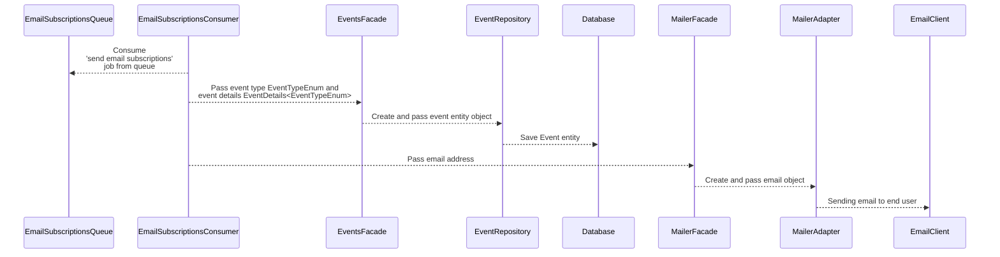

## Create email subscription job flow

```mermaid
  sequenceDiagram
    participant EmailSubscriptionsQueue
    EmailSubscriptionsConsumer -->> EmailSubscriptionsQueue: Consume <br/>'send email subscriptions'<br/> job from queue
    EmailSubscriptionsConsumer -->> EventsFacade: Pass event type EventTypeEnum and <br/>event details EventDetails<EventTypeEnum>
    EventsFacade -->> EventRepository: Create and pass event entity object
    EventRepository -->> Database: Save Event entity
    EmailSubscriptionsConsumer -->> MailerFacade: Pass email address
    MailerFacade -->> MailerAdapter: Create and pass email object
    MailerAdapter -->> EmailClient: Sending email to end user
```
