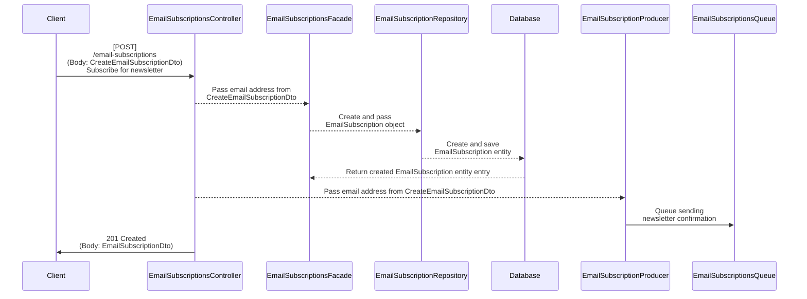

## Request to email subscription flow

```mermaid
  sequenceDiagram
    Client ->> EmailSubscriptionsController: [POST]<br/>/email-subscriptions<br/>(Body: CreateEmailSubscriptionDto)<br/>Subscribe for newsletter
    EmailSubscriptionsController -->> EmailSubscriptionsFacade: Pass email address from <br/>CreateEmailSubscriptionDto
    EmailSubscriptionsFacade -->> EmailSubscriptionRepository: Create and pass <br/>EmailSubscription object
    EmailSubscriptionRepository -->> Database: Create and save <br/>EmailSubscription entity
    Database -->> EmailSubscriptionsFacade: Return created EmailSubscription entity entry
    #
    EmailSubscriptionsController -->> EmailSubscriptionProducer: Pass email address from CreateEmailSubscriptionDto
    EmailSubscriptionProducer ->> EmailSubscriptionsQueue: Queue sending <br/>newsletter confirmation
    EmailSubscriptionsController ->> Client: 201 Created <br/>(Body: EmailSubscriptionDto)
```

For docs for EmailQueue go to [email-sending-processor](https://github.com/elpassion/flounder/tree/uml/apps/backend/src/modules/email-sending-processor)
